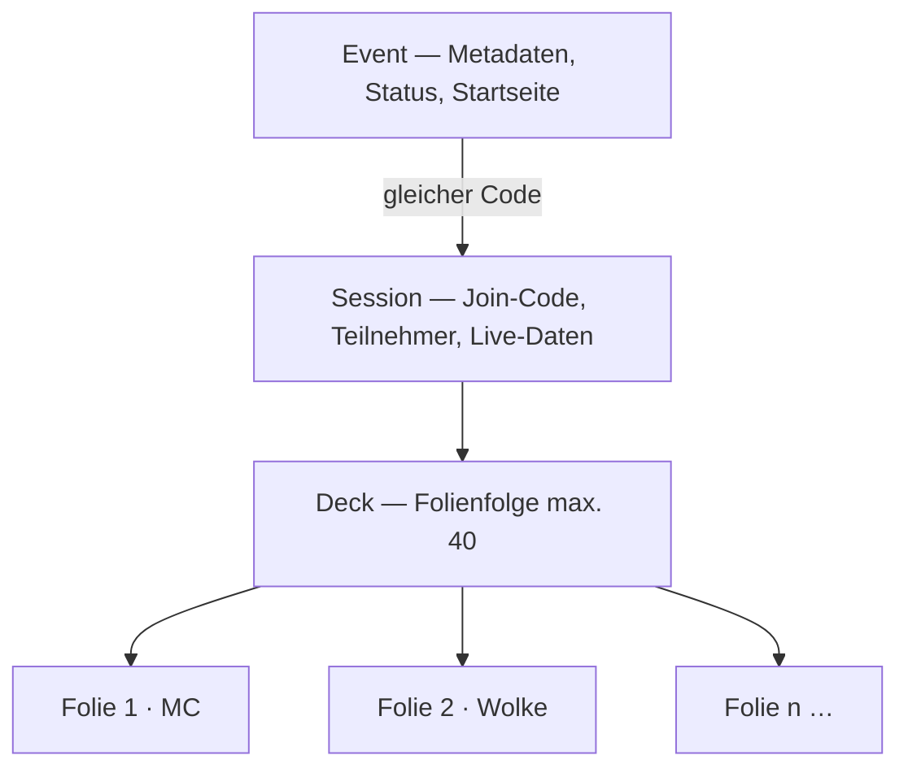

# Pulse — Benutzerhilfe

Zusammenfassung der In-App-Hilfe (`#/help`, `#/admin/help`) als druckbares Markdown-Dokument.  
**Stand:** Programmversion **v1.2.1** · Hilfe-Katalog **Version 9** · **25 Artikel** · 2026-09-03.

Die interaktive Hilfe mit Rollenfilter, Suche, Tour und Feedback liegt im Frontend unter `frontend/help/`. Dieses Dokument spiegelt die gleiche Struktur für Admins, Redaktion und Schulungsunterlagen.

**Versionspflege:** Nach Änderung der Version in `package.json` bitte `npm run docs:sync-version` ausführen — dann stimmen In-App-Hilfe, HTML-Artikel und diese Markdown-Datei mit der Programmversion überein. Live-Stand auch unter `#/admin/updates` und `GET /api/health`.

---

## Inhaltsverzeichnis

1. [Willkommen & Einstieg](#1-willkommen--einstieg)
2. [Session-Architektur verstehen](#2-session-architektur-verstehen)
3. [Schnellstart in 5 Minuten](#3-schnellstart-in-5-minuten)
4. [Funktionen im Überblick](#4-funktionen-im-überblick)
5. [Rollen-Guides](#5-rollen-guides)
6. [Session erstellen und verwalten](#6-session-erstellen-und-verwalten)
7. [Events und Session-Decks](#7-events-und-session-decks)
8. [Umfragen und Wortwolken](#8-umfragen-und-wortwolken)
9. [Live-Q&A](#9-live-qa)
10. [Quiz und Rangliste](#10-quiz-und-rangliste)
11. [Administration](#11-administration)
12. [Installation und Betrieb](#12-installation-und-betrieb)
13. [SSL-Zertifikate](#13-ssl-zertifikate)
14. [Datenschutz](#14-datenschutz)
15. [Häufige Fragen (FAQ)](#15-häufige-fragen-faq)
16. [Fehlerbehebung](#16-fehlerbehebung)
17. [Typische Szenarien (Use-Cases)](#17-typische-szenarien-use-cases)
18. [Glossar](#18-glossar)
19. [Druck-Guides](#19-druck-guides)
20. [Verwandte Dokumente](#20-verwandte-dokumente)

---

## 1. Willkommen & Einstieg

Wählen Sie Ihre Rolle in der Hilfe (`#/help`):

| Rolle | Dauer | Einstieg |
|---|---|---|
| **Teilnehmer** | ca. 5 Min. | `#/help/roles-participant` |
| **Presenter** | ca. 15 Min. | `#/help/roles-presenter` |
| **Admin** | ca. 30 Min. | `#/help/roles-admin` |

**Empfohlene Reihenfolge (Presenter):**

1. [Session-Architektur](#2-session-architektur-verstehen) (2 Min.)
2. [Schnellstart](#3-schnellstart-in-5-minuten)
3. [Session verwalten](#6-session-erstellen-und-verwalten)
4. [Use-Cases](#17-typische-szenarien-use-cases)

---

## 2. Session-Architektur verstehen

> **Kernregel:** Ein **Event = genau eine Session = ein Join-Code = ein Deck**. Es gibt keine parallelen „Sets“.



### Beispiel

| Schicht | Wert |
|---|---|
| Event | „Bürgerversammlung Klimaschutz 2026“, Status *aktiv* |
| Join- / Session-Code | `482917` (6 Ziffern) |
| Deck | 8 Folien: 3× MC, 2× Wortwolke, 2× Q&A, 1× Quiz |

### Begriffe

- **Event vs. Session:** Event = öffentliche Hülle; Session = technische Umfrage. **Ein Code** für beides.
- **Deck vs. Folie:** Deck = Abfolge; Folie = ein Interaktionsschritt.
- **Join-Code vs. Admin-Schlüssel:** Join für Teilnehmende; Admin-Schlüssel oder Presenter-Passwort für Steuerung.
- **Lobby vs. Reveal:** Lobby = Warteraum; Reveal = Ergebnisse zeigen (`R`).

**Ad-hoc ohne Event:** `#/admin` → Session starten, kein Katalogeintrag auf der Startseite.

---

## 3. Schnellstart in 5 Minuten

> **Tipp:** Zuerst [Architektur](#2-session-architektur-verstehen) lesen.

**Video (geplant):** „Ihre erste Session in 5 Minuten“ (5:23) — 3 Umfragen anlegen, Lobby, erste Stimmen. Textalternative: Transkript im Artikel `#/help/getting-started`.

1. **Session oder Event anlegen** — Ad-hoc: `#/admin`. Geplant: `#/admin/events`, Deck unter `#/admin/sessions/<code>`.
2. **Code teilen** — 6-stelliger Code + QR. Handy: **Daumenzone**.
3. **Optional: Lobby** — „Los geht's“ startet erste Folie.
4. **Abstimmen** — Live-Updates; `R` für Reveal.
5. **Weiterblättern** — Max. **40 Folien**; live bearbeiten.

---

## 4. Funktionen im Überblick

| Funktion | Kurzbeschreibung |
|---|---|
| **Multiple Choice** | 2–6 Antworten, Balken nach Reveal |
| **Picker** | 10–50 Optionen, Suche, Kategorien, Single/Multi, List/Grid/Dropdown — `#/help/picker` |
| **Ranking** | Reihenfolge; Borda-Auswertung |
| **100 Punkte** | Genau 100 Punkte verteilen |
| **Freitext** | Max. 280 Zeichen |
| **Bildwahl / Termin** | Optionen mit Bild oder Zeitfenstern |
| **Wortwolke** | Häufigkeit = Größe, PNG-Export |
| **Live-Q&A** | Kategorien, privat, Upvote, Moderation |
| **Quiz** | Timer, Teams, Power-Ups, Rangliste |
| **Bewertungsskala** | 5 / 7 / 10 Stufen |
| **Lobby** | Warteraum bis Start |
| **Reaktionen** | Emojis, nicht gespeichert |
| **Events** | Join nur bei Status *aktiv* |
| **Dynamisches Formular** | Admin zeigt nur passende Blöcke je Folientyp (`#/admin`) |

---

## 5. Rollen-Guides

### Teilnehmende (~5 Min.)

1. Code/QR → `#/join/<code>`
2. Bei Events: Status *aktiv* abwarten
3. Lobby → warten auf Start
4. Nach Folientyp abstimmen; Q&A upvoten; Reaktionen in Daumenzone
5. Offline-Banner: WLAN prüfen, neu laden

### Presenter (~15 Min.)

1. Session/Event anlegen, Deck pflegen
2. Lobby, Folienwechsel, Reveal (`R`)
3. Q&A moderieren, gruppieren, antworten
4. Quiz mit Timer, Teams, Rangliste
5. Notfall, Export (Q&A CSV/PDF)

### Admin (~30 Min.)

1. Branding, Datenschutz, SSL (`#/admin/*`)
2. Events verwalten, Status setzen
3. Installation (Docker/VPS), `ADMIN_SECRET`
4. Settings-Export Schema 2, `data/` sichern
5. Troubleshooting, Audit-Logs

---

## 6. Session erstellen und verwalten

### Session anlegen (Kurzversion)

1. `#/admin` → Fragetyp wählen
2. **Grundlagen:** Frage (max. 500 Zeichen), optional Unterzeile
3. **Optionen** (bei MC, Quiz, Ranking, Picker, …): Antworten pflegen — Picker: 10–50, ggf. Massen-Import
4. **Typ-Einstellungen** erscheinen passend zum Typ (z. B. Picker: Kategorien, Suche, Layout)
5. **Erweiterte Einstellungen** (einklappbar): Notizen, geplante Minuten, Reveal-Standard
6. „Zur Liste hinzufügen“ (weitere Folien)
7. Optional: Presenter-Passwort, Vorlage
8. „Session starten“ → Join-Code notieren

| Formular-Abschnitt | Wann sichtbar |
|---|---|
| Grundlagen | immer |
| Optionen | MC, Quiz, Ranking, 100 Punkte, Bildwahl, **Picker**, Termin |
| Typ-Einstellungen | je gewähltem Typ |
| Erweitert | immer (einklappbar) |

> Beim **Folientyp-Wechsel** erscheint eine Warnung, wenn bestehende Optionen verworfen würden.

| Nach Schritt | Ergebnis |
|---|---|
| Optionen eingegeben | Erste Folie definiert |
| Liste gefüllt | Deck-Entwurf sichtbar |
| Gestartet | Present-Ansicht, Code, ggf. Lobby |

> **Warnung:** Admin-Schlüssel nicht notiert + anderer Browser → Presenter-Passwort nötig.

### Deck-Editor (`#/admin/sessions/<code>`)

| Aktion | Wie |
|---|---|
| Inhalt bearbeiten | Stift oder Doppelklick. **Einfache Typen** (MC, Bewertung, Wortwolke, Freitext, Q&A): Inline. **Komplexe Typen** (Quiz, Ranking, 100 Punkte, Bildwahl, Termin, **Picker**): Modal mit Live-Vorschau (Picker). Alt+Stift = immer Modal. |
| Speichern | Button oder Ctrl/Cmd+S. Nach 30 s Pause **Auto-Save**. Ungespeicherte Änderungen: Warnung beim Schließen. |
| Löschen | Bestätigung; Toast mit **Rückgängig** (5 s). |
| Mehrfachauswahl | Checkboxen (Shift = Bereich). Bulk: Eigenschaften (Reveal, Minuten, Notizen), duplizieren, löschen. |
| Reihenfolge | Drag & Drop oder Pfeile. |
| Neue Folie / kopieren | Toolbar-Buttons; Kopieren aus anderer Session. |
| Shortcuts | ↑/↓ Fokus · Ctrl/Cmd+E bearbeiten · Ctrl/Cmd+D duplizieren · Entf löschen |

---

## 7. Events und Session-Decks

| Route | Zweck |
|---|---|
| `#/admin/events` | Event-Liste, Metadaten, QR |
| `#/admin/sessions/<code>` | Deck-Editor (Inhalt bearbeiten) |
| `#/admin` | Ad-hoc ohne Startseiten-Karte |
| `#/stage/<code>` | Leinwand inkl. optionalem Countdown |

| Status | Bedeutung |
|---|---|
| **Geplant** | Sichtbar, Join gesperrt |
| **Aktiv** | Join freigegeben |
| **Abgeschlossen** | Ergebnisse; Join weiter möglich |
| **Archiviert** | Nicht auf Startseite; Join blockiert |

Optional: **Startuhrzeit** (Countdown auf Leinwand/Presenter), **Event-Grafik** hinter dem Countdown. Folien kopieren aus anderer Session (max. 40). Event löschen nur bei *geplant* oder *archiviert*.

---

## 8. Umfragen und Wortwolken

- **MC:** 2–6 Optionen, eine Stimme pro Gerät/Folie, Reveal mit `R`.
- **Picker:** 10–50 Optionen, Suche, Kategorien, Single/Multi-Select, List/Grid/Dropdown — siehe Hilfe-Artikel `#/help/picker`.
  - **Admin:** Massen-Import (eine Zeile pro Option), Kategorien-Editor mit Farbe, Live-Vorschau.
  - **Teilnehmende:** Suche (200 ms Debounce), Kategorie-Filter, Virtual Scroll ab 30 Optionen.
  - **Ergebnisse:** Balkendiagramm; bei >30 Optionen Top 10 + Rest; mit Kategorien gruppiert.
  - **Dropdown:** nur Single-Select; Mehrfachauswahl nutzt Listen-/Raster-Ansicht.
- **Ranking / 100 Punkte:** Sortieren bzw. exakt 100 Punkte.
- **Freitext:** 280 Zeichen, Wortfilter.
- **Wortwolke:** Max. 32 Zeichen/Wort, Stoppwörter, PNG `wortwolke.png`.

---

## 9. Live-Q&A

Fragen max. 500 Zeichen; Kategorien Technik, Organisation, Inhalt, Sonstiges. Upvote, privat, gruppieren, Presenter-Antwort (800 Zeichen). Export CSV/PDF mit `User_xxxx`. In Lobby und Notfall keine neuen Fragen.

---

## 10. Quiz und Rangliste

Timer 5–60 s; mehrere richtige Antworten; Teams; Power-Ups (50:50, Doppelpunkte). **Leertaste** auf Quiz-Folien nicht für Folienwechsel. Gesamtrangliste über alle Quiz-Folien.

---

## 11. Administration

Menü: **Sessions** · **Events** · **Teams** · **Branding** · **Datenschutz** · **SSL** · **E-Mail** · **Einstellungen** · **Updates** · **Backups** · **Benutzer** · **Hilfe**

| Schlüssel | Zweck |
|---|---|
| Session-Admin-Schlüssel | Folien (inkl. Inhaltseditor), Moderation (Start-Browser) |
| Presenter-Passwort | Entsperren von anderem Gerät |
| ADMIN_SECRET | Server-API (`.env`) |

Deck eines Events: `#/admin/sessions/<code>`. Settings-Export `pulse-settings.json` Schema 2 — **ohne** Sessions, Events, Audit.

### Instanz-Backups (`#/admin/backups`)

- **Backup erstellen** — ZIP mit Datenbank, JSON, SSL, Uploads; Download startet automatisch.
- **Gruppenweise Wiederherstellung** — Bereiche wie in der Admin-Navigation wählen. **Versionshinweis:** Abweichende Backup-Version → automatische Migration (`dataMigration.js`).
- **Erstlogin:** Nach Bootstrap-Anmeldung optional `#/admin/onboarding` — Backup hochladen statt Shell-Installer.
- **Automatische Backups** — täglich/wöchentlich, Aufbewahrung konfigurierbar.

---

## 12. Installation und Betrieb

Ausführlich: `docs/installation.md`

```bash
./scripts/install.sh              # lokal
./scripts/install.sh --docker     # Compose
sudo ./scripts/install-vps-ubuntu.sh   # VPS
```

Daten in `./data/` (`pulse.db`, JSON, `ssl/`). Zugangsdaten VPS: `INSTALL-CREDENTIALS.txt`.

**Backup bei Erstlogin:** Nach der ersten Anmeldung mit E-Mail + Installations-Kennwort erscheint `#/admin/onboarding` — dort optional Backup hochladen (nicht im Shell-Installer).

**Laufender Betrieb:** `#/admin/backups` oder regelmäßig `./data/` sichern.

---

## 13. SSL-Zertifikate

Let’s Encrypt HTTP-01 unter `#/admin/ssl`. DNS → Server, Port 80, kein Wildcard/localhost. PEMs im Settings-Export — wie Secret behandeln.

---

## 14. Datenschutz

Anonym abstimmen — **keine Tracking-Cookies** für Teilnehmende. Optional: Instanz-Benutzer erhalten ein **Session-Cookie** (`pulse_auth`) nach PIN-Anmeldung. `localStorage` für Sprache, Theme, Tour. Texte: `#/privacy`, `#/impressum`. Verfahrensverzeichnis: `docs/verfahrensverzeichnis.md`.

---

## 15. Benutzerverwaltung (optional)

Aktivierung über `USER_AUTH_ENABLED=1` (Installation oder `.env`).

| Thema | Kurzinfo |
|---|---|
| Anmeldung | `#/admin/login` — E-Mail, dann 6-stelliger PIN (10 Min.) |
| Rollen | **Admin** (alles), **Editor** (Events/Sessions), **Viewer** (lesen, kein „Neues Event“) |
| Profil | `#/admin/profile` — Anzeigename, Kennwort ändern |
| Benutzer | `#/admin/users` — nur Admin; Step-up-PIN vor Änderungen |
| SMTP | Produktion: `SMTP_*` in `.env`; lokal: `AUTH_DEV_MAILBOX=1` |
| Notfall | `ADMIN_SECRET` bleibt für Bootstrap/API |

Ausführlich: `#/admin/help/auth-login` und `frontend/help/auth-login.html`.

---

## 16. Häufige Fragen (FAQ)

**Konto nötig?** — **Teilnehmende:** Nein. **Administration:** Ja, wenn Benutzerverwaltung aktiv ist (PIN-Login). **Session vs. Event?** — Gleicher Code, Event = Hülle. **Join gesperrt?** — Status *geplant*/*archiviert*. **Probe?** — Kein kopierbarer Join-Link in UI. **Picker vs. MC?** — MC: 2–6 Optionen; Picker: 10–50 mit Suche/Kategorien — `#/help/picker`.

---

## 17. Fehlerbehebung

### Teilnehmer können nicht joinen

```
Start → Event aktiv? → Nein → Status auf aktiv
     → Code 6 Ziffern? → Nein → von Leinwand kopieren
     → Server/HTTPS ok? → Nein → Healthcheck / SSL
     → Lobby? → Ja → „Los geht's“
```

### HTTPS funktioniert nicht

```
DNS → Port 80 → Zertifikat aktiv → ACME-Challenge → kein Staging
```

### Debug-Checkliste (Admin)

1. `docker compose logs pulse`
2. `https://<domain>/api/health`
3. `#/admin/ssl`, `#/admin`, `#/admin/audit`

| Problem | Lösung |
|---|---|
| WebSocket hängt | WLAN, neu laden, `REDIS_URL` bei Multi-Prozess |
| Admin gesperrt | Admin-Schlüssel oder Passwort; 5 Min. nach 3 Fehlversuchen |
| Admin-API 401 | `ADMIN_SECRET` in `.env` |

---

## 18. Typische Szenarien (Use-Cases)

### Bürgerversammlung (~200 TN, ~90 Min.)

Event aktiv, Deck: MC + Wolken + Q&A, Wortfilter, Lobby. QR groß, Status vor Start prüfen.

### Team-Meeting mit Quiz (~30 Min.)

Ad-hoc-Session, Quiz mit Teams/Power-Ups, keine Lobby nötig.

### Schulung mit Skalen (~15 Min.)

Wiederkehrendes Event, MC + Bewertungsskala, selbstgesteuert, Ergebnisse sofort.

### Ortsauswahl mit Picker (~50 Städte)

Picker-Folie, Massen-Import, Kategorien nach Bundesland, Suche, Single-Select, Reveal auf der Bühne.

---

## 19. Glossar

| Begriff | Erklärung |
|---|---|
| **Session** | Laufende Umfrage in `pulse.db` |
| **Event** | Metadaten mit gleichem `sessionCode` |
| **Deck** | Folienfolge (max. 40); Bearbeitung unter `#/admin/sessions/<code>` |
| **Lobby** | Warteraum |
| **Reveal** | Ergebnisse zeigen (`R`) — inkl. Picker |
| **Picker** | Folientyp für 10–50 Auswahloptionen mit Suche/Kategorien |
| **Dynamisches Formular** | Admin-UI zeigt nur passende Felder je Folientyp |
| **Daumenzone** | Unterer Handy-Bereich |
| **ADMIN_SECRET** | Instanz-Geheimnis `.env` |
| **Folien bearbeiten** | Frage/Optionen ändern (Inline oder Modal); API `PATCH …/slides/:id` |

---

## 19. Druck-Guides

| Guide | Datei |
|---|---|
| Präsentator | `frontend/help/guides/presenter.html` |
| Teilnehmende | `frontend/help/guides/participant.html` |
| Admin-Checkliste | `frontend/help/guides/admin-checklist.html` |

Im Browser: Drucken → „Als PDF sichern“. Version und Datum im Guide-Kopf.

---

## 20. Verwandte Dokumente

| Dokument | Inhalt |
|---|---|
| `docs/installation.md` | Installation |
| `docs/projektdokumentation.md` | Technische Spezifikation |
| `docs/verfahrensverzeichnis.md` | DSGVO Art. 30 |
| `frontend/help/articles.json` | Hilfe-Katalog v9 · Programm v1.2.1 (25 Artikel) |

---

*Bei Abweichungen gilt der Stand der HTML-Artikel unter `frontend/help/` (Programmversion **v1.2.1**, Katalog-Version in `articles.json`).*
